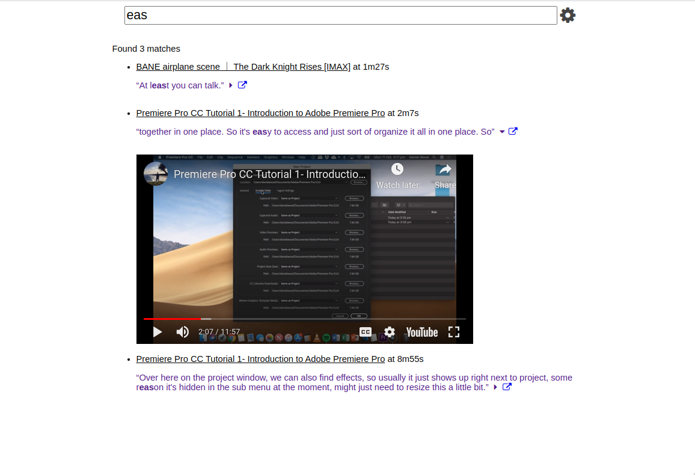

Extract and search through youtube transcriptions at lightning speed with timecodes.

# Tools
- Go
- Htmx
- whisper.cpp
- yt-dlp
- shisper

# Dependencies
- whisper.cpp (c++ implementation of OpenAI's whisper)
- shisper (shell script I call from go to process wav files)
- yt-dlp (youtube scrapping utility)

# How it works
## Getting the youtube content
The pipeline is strung together with shell commands so it just:

downloads the video (yt-dlp) -> extracts the audio (yt-dlp) -> transcribes audio (shisper) -> parses transcript (main.go)

After the pipeline is finished a .bin file is saved in the savedresources directory, which stores the internal data basically.

## Searching
After it's in memory, I just go through every "source" (Youtube video) and check against the segments. First 10 segments that match get shown to the user.

I basically do exact matches for the search since it was easy to implement, I also added support for Levenshtein distance searching but it was too slow to be useful.

